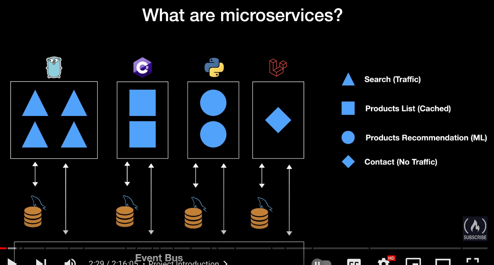
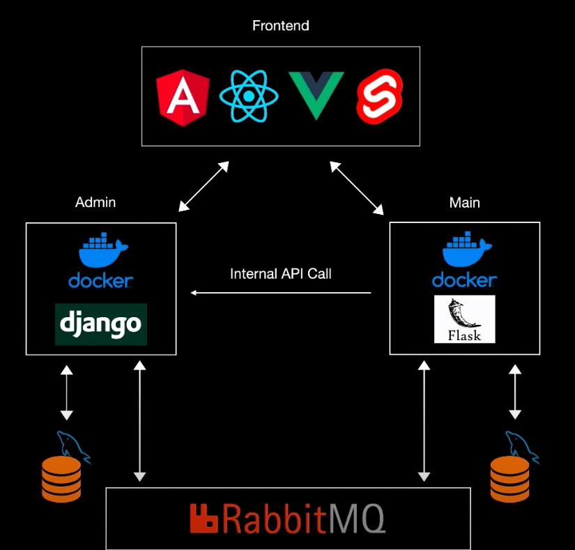

# Sample Microservices App

This is a simple app to demonstrate microservices. It is implemented with Django and Flask services on the backend, React webapp on the frontend, Docker for handling containerization, and RabbitMQ for events.

# Setup

## MySQL

    $ brew install mysql

Start mysql services:

    $ brew services start mysql

## Docker

### Create new Django app in container

    $ docker-compose exec backend sh
    $ python manage.py startapp products

## Environment Variables

Create a .env file in the admin folder with the following variables:

    SECRET_KEY=your-django-secret-key
    MYSQL_DB=your-mysql-db-name
    MYSQL_USER=your-mysql-user-name
    MYSQL_PASSWORD=your-mysql-password
    MYSQL_HOST=your-mysql-host-name
    MYSQL_PORT=your-mysql-port

Create a .env file in the main folder with the following variables:

    MYSQL_DB=your-mysql-db-name
    MYSQL_USER=your-mysql-user-name
    MYSQL_PASSWORD=your-mysql-password
    MYSQL_HOST=your-mysql-host-name
    MYSQL_PORT=your-mysql-port

## Access

Django: http://0.0.0.0:8000/
Flask: http://0.0.0.0:8001/

# Run

## Admin - Django App

Start admin service:

    $ cd admin/
    $ docker-compose up

### Make Migrations

All apps:

    $ docker-compose exec django python manage.py makemigrations

Single app:

    $ docker-compose exec django python manage.py makemigrations [app-name]

### Migrate

    $ docker-compose exec django python manage.py migrate

### Fixtures

Load single fixture:

    $ docker-compose exec django python manage.py [fixture-name]
    $ docker-compose exec django python manage.py loaddata country.json

Load all fixtures:

    $ docker-compose exec django python manage.py loaddata **/fixtures/*.json

## Main - Flask App

Start main service:

    $ cd main/
    $ docker-compose up

### Migrations

Open shell:

    $ docker-compose exec backend sh

Create migration repository:

    $ flask db init

Generate migrations:

    $ flask db migrate -m 'Initial migration'

Apply migrations to DB:

    $ flask db upgrade

# Design and Architecture

# Docker Instructions

Build:

    $ docker-compose up --build

Open shell:

    $ docker-compose exec [service-name] sh

Stop Containers:

    $ docker-compose stop

Check Currently Running Images:

    $ docker-compose ps

Remove Docker Containers:

    $ docker-compose rm -f

To remove all stopped containers:

    $ docker rm $(docker ps -a -q)

Remove all dangling images:

    $ docker rmi -f $(docker images -qf dangling=true)

Remove Images:

    $ docker image prune -a

Remove Volumes:

    $ docker volume rm $(docker volume ls -q)
